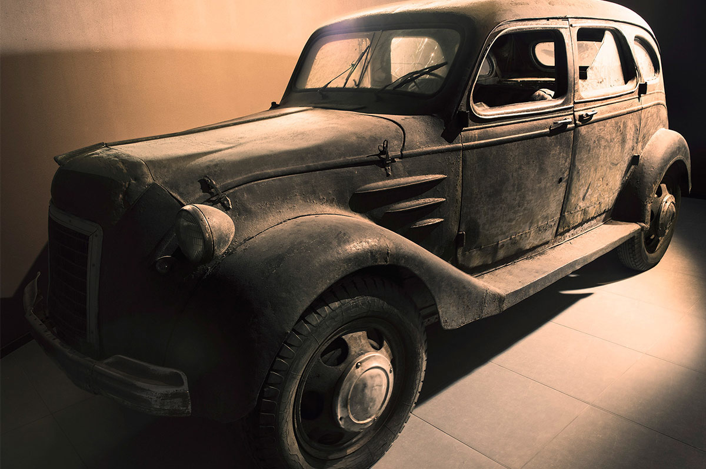
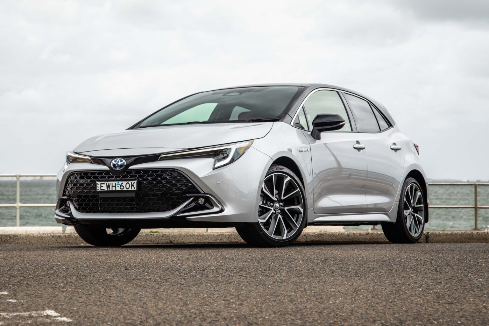
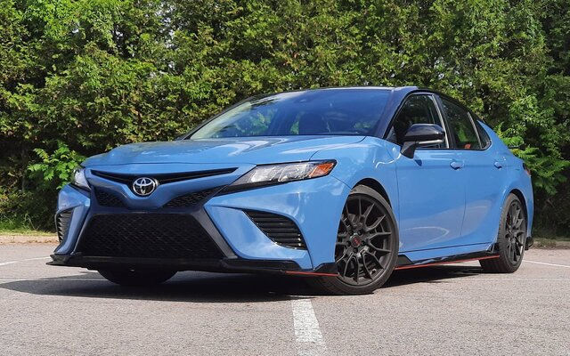
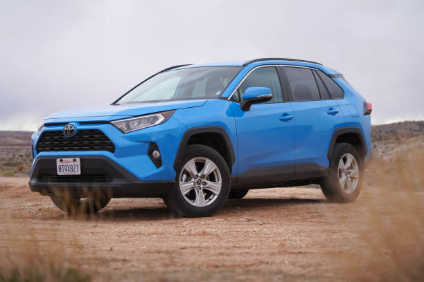
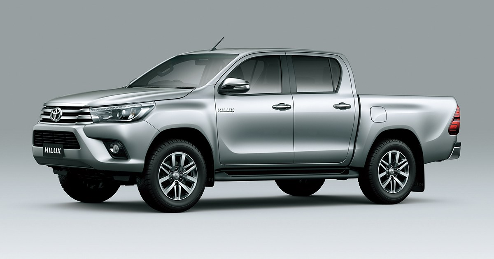
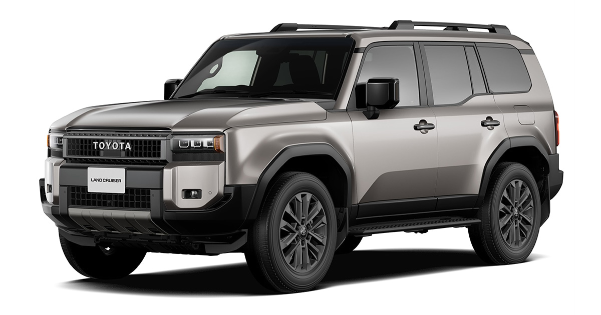

<html>
<head>
<title>TOYOTA</title>

</head>
<body background="fondo.jpg">
<pre>

<b>
TOYOTA
</b>

<b>Historia de Toyota:</b>

Toyota es una empresa automotriz japonesa, fundada en 1937 por Kiichiro Toyoda. Es una de las mayores compañías automotrices del mundo, conocida por 
producir una amplia gama de vehículos,incluyendo autos, camiones y SUVs. Toyota es reconocida por su enfoque en la calidad, durabilidad y eficiencia en el 
consumo de combustible. La compañía ha sido pionera en la producción de vehículos híbridos, siendo el Toyota Prius uno de los modelos más conocidos en este 
segmento. Además, Toyota tiene una fuerte presencia global, con fábricas y centros de investigación en varios países.

Los primeros autos de Toyota se fabricaron en 1936, cuando la compañía aún era parte de Toyota Industries, una empresa dedicada a la fabricación de telares. 
El primer modelo fue el Toyota AA, un sedán basado en el diseño del Chrysler Airflow estadounidense. Kiichiro Toyoda, fundador de Toyota, decidió entrar en 
la industria automotriz tras estudiar la producción en masa de automóviles en Estados Unidos. Para fabricar los primeros autos, Toyota combinó técnicas artesanales
con procesos de producción en serie, estableciendo las bases para lo quemás tarde se convertiría en el Sistema de Producción Toyota, conocido por su eficiencia y alta calidad.

  

<b>Mejores Motores de Toyota:</b>
<ul type=circle>
<u>Motor 2JZ-GTE (3.0L I6 Turbo)</u>
<li>Uso: Toyota Supra MK4 (1993-2002).
<li>Características: Conocido por su robustez y capacidad para soportar alta potencia con modificaciones. Es uno de los motores más icónicos en la comunidad automotriz.

<u>Motor 1UZ-FE (4.0L V8)</u>
<li>Uso: Lexus LS400, Toyota Soarer.
<li>Características: Un motor V8 de alto rendimiento, famoso por su suavidad, durabilidad y capacidad para rendir a alto nivel durante muchos años.

<u>Motor 1GR-FE</u>
<li>Uso: Toyota Tacoma, 4Runner, FJ Cruiser.
<li>Características: Confiable y duradero, es ampliamente utilizado en vehículos todoterreno y camionetas, ofreciendo un buen equilibrio entre potencia y eficiencia.

<u>Motor 4A-GE (1.6L I4)</u>
<li>Uso: Toyota Corolla AE86, Toyota MR2.
<li>Características: Conocido por su alto rendimiento y la capacidad de girar a altas revoluciones, fue un favorito en los autos deportivos compactos.

<u>Motor 2GR-FE (3.5L V6)</u>
<li>Uso: Toyota Camry, Avalon, Lexus ES350.
<li>Características: Este motor V6 ofrece un excelente equilibrio entre potencia y eficiencia de combustible, siendo una opción popular en sedanes y SUVs.

<u>Motor 1.8L 2ZR-FXE Híbrido</u>
<li>Uso: Toyota Prius.
<li>Características: Parte fundamental del éxito del Toyota Prius, este motor híbrido es conocido por su eficiencia en el consumo de combustible y bajas emisiones.

<marquee behavior="alternate"><b>5 Modelos más vendidos de Toyota:</b></marquee>
<ol>
<li>Toyota corolla
 
<li>Toyota Camry
  
<li>Toyota RAV4
 
<li>Toyota Hilux
 
<li>Toyota Land Cruiser
 
